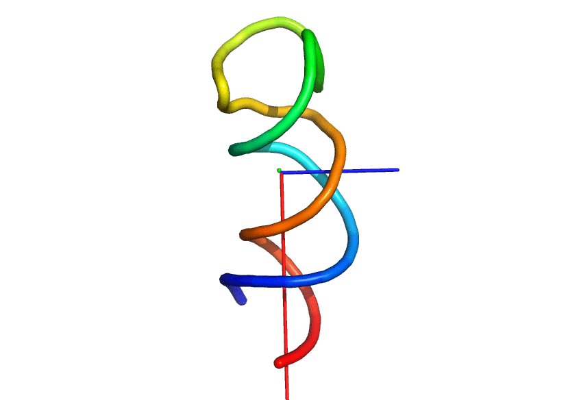

Principal axes (of RNA)
==============

This program reads a .pdb file, computes principal axes and produces a .pml PyMoL script to view axes.

In this version of the program, all atoms are read and the masses of atoms are not taken into account!

## Example

with the x-ray structure of a rigorously conserved RNA element within the SARS virus genome ([1XJR](http://www.rcsb.org/pdb/explore.do?structureId=1XJR) from the [Protein Data Bank](http://www.rcsb.org/pdb/home/home.do)):

```text
$ ./principal_axes.py test_data/1xjr_clean.pdb
1024 atomes found if test_data/1xjr_clean.pdb
Coordinates of the geometric center:
[ 47.58264063  35.26179395  46.47487402]
(Unordered) eigen values:
[ 264477.25123486   37291.72833667   32510.49200449]
(Unordered) eigen vectors:
[[ 0.79451019 -0.57519738 -0.19468316]
 [-0.03231119  0.28009986 -0.95942694]
 [-0.60639059 -0.76856493 -0.20395688]]
Inertia axis are now ordered !
The first principal axis is in red
coordinates:  [ 0.79451019 -0.03231119 -0.60639059]
eigen value:  264477.251235

The second principal axis is in green
coordinates: [-0.57519738  0.28009986 -0.76856493]
eigen value: 37291.7283367

The third principal axis is in blue
coordinates: [-0.19468316 -0.95942694 -0.20395688]
eigen value: 32510.4920045

You can view principal axes with PyMOL:
pymol test_data/1xjr_clean_axes.pml test_data/1xjr_clean.pdb
```

```text
pymol test_data/1xjr_clean_axes.pml test_data/1xjr_clean.pdb
```



## History

The first version of this script had been posted in the Biostar forum as an answer to [Question: Protein 3D structure principal axes](http://www.biostars.org/p/7393/)
